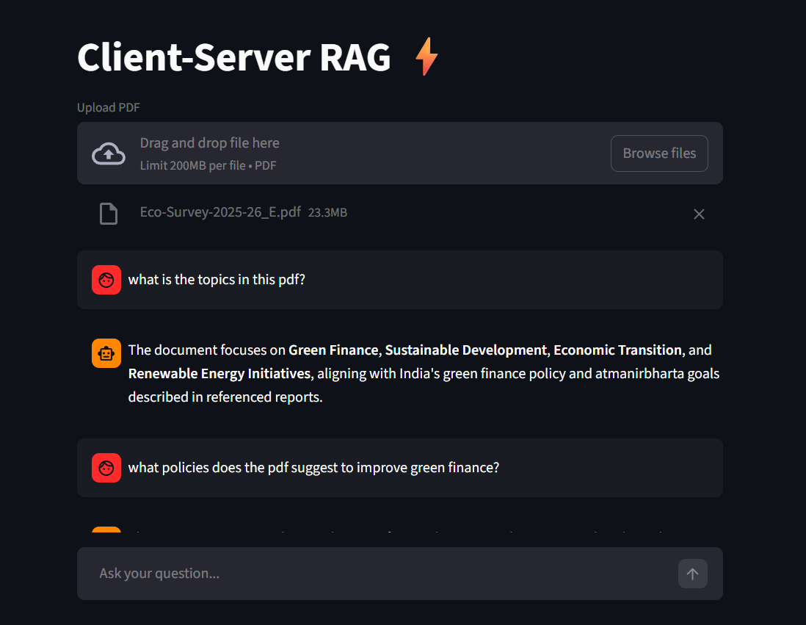

# 📄 PDF RAG Chatbot (Client-Server Architecture)

A Retrieval-Augmented Generation (RAG) chatbot that allows users to "chat" with their PDF documents. Built with a **FastAPI** backend for processing and a **Streamlit** frontend for the UI.

## 🏗️ Architecture
- **Backend:** FastAPI (handles PDF processing, vector embeddings, and LLM interaction).
- **Frontend:** Streamlit (handles user UI and file uploads).
- **AI Stack:** LangChain, ChromaDB, HuggingFace Embeddings, and OpenRouter LLMs.

## 🚀 How to Run locally

### 1. Clone the repo

Repository URL:
https://github.com/VD400/rag-pdf-chatbot

```bash
git clone https://github.com/VD400/rag-pdf-chatbot.git
cd rag-pdf-chatbot
```

### 2. Create a Virtual Environment
It is recommended to use a virtual environment to avoid conflicts.
```bash
python -m venv venv
# Windows
.\venv\Scripts\activate
# Mac/Linux
source venv/bin/activate
```

### 3. Install Dependencies
```bash
pip install -r requirements.txt
```

### 4. Configure Environment Variables
1. Create a file named .env in the root directory.
2. Add your OpenRouter API key: 
OPENROUTER_API_KEY=sk-or-v1-your-key-here

### 5. Run the application
You need to open **two separate terminals** to run the backend(api.py) and frontend(app.py) simultaneously.  

**Terminal 1 : Start the Backend (FastAPI)**
```bash 
uvicorn api:app --reload
```
Wait until you see: Application setup complete.

**Terminal 2 : Start the Frontend (Streamlit)**
```bash
streamlit run app.py
```

### Demo Run of the application
